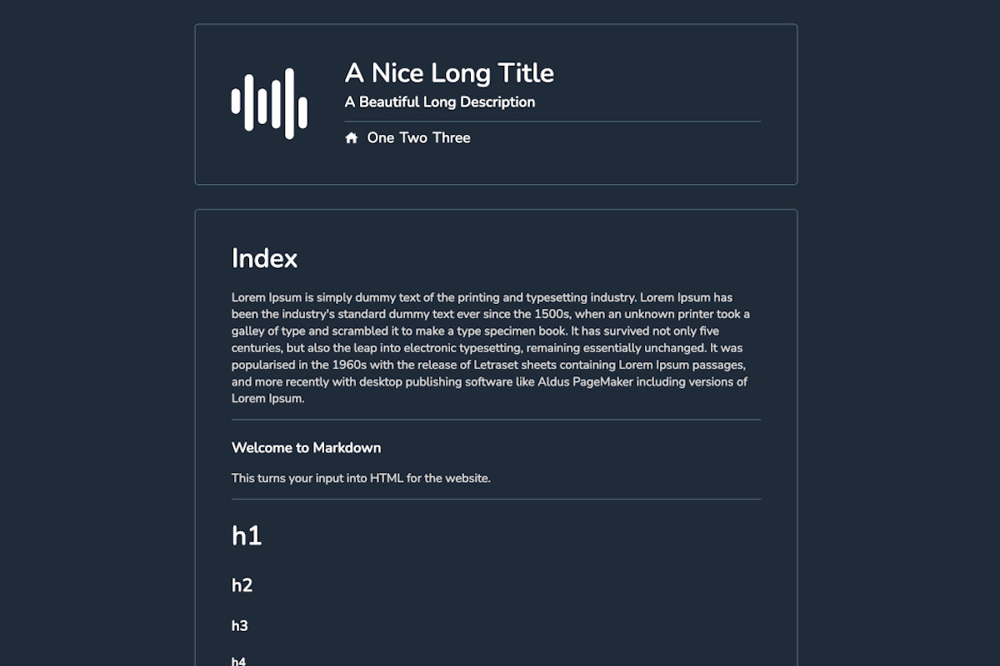

# Blurg

A website with editable content using markdown files stored on Github. Pages and partials are stored in the browser session storage for speed and to reduce calls to Github API.

* * *

### Screenshot

* * *

### Editable Tree

    ├── contents
    │   ├── 1-one.md
    │   ├── 2-two.md
    │   └── 3-three.md
    ├── images
    │   └── thing.jpg
    ├── partials
    │   ├── header.md
    │   └── index.md
