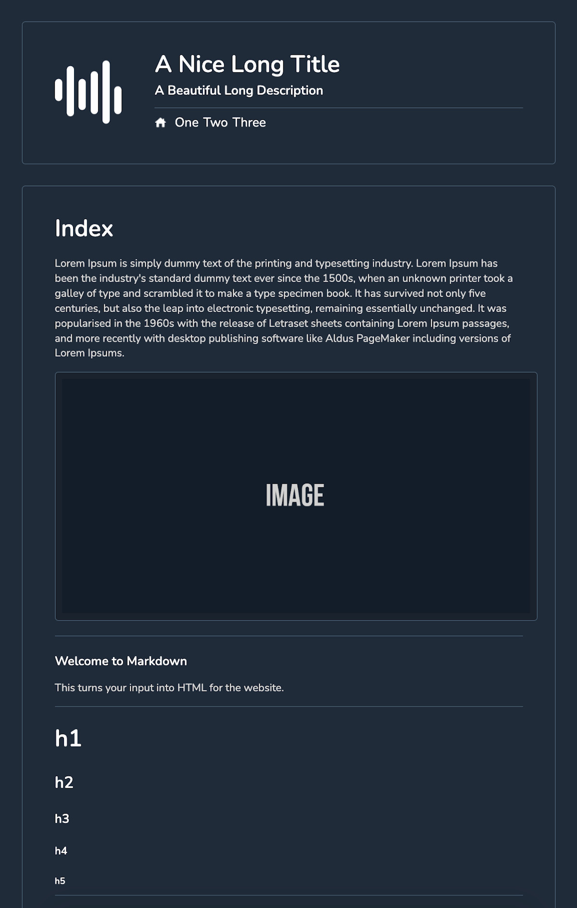

# Blurg

A website with editable content using markdown files stored on Github. Pages and partials are stored in the browser session storage for speed and to reduce the amount of calls to the Github API.

* * *

### Screenshot



* * *


### Install Instructions

1.  Fork the Blurg repository from Github: <https://github.com/impshum/blurg>
2.  Change the description and website of your forked repo to your website title and url (more info below).
3.  Edit the config file with your details (`/config.php`).
4.  Download the source code of your fork and upload to your server.
5.  Edit the partials in `/contents/partials/header.md` and `/contents/partials/index.md`.
6.  Edit/create the pages `/contents/`.
7.  Start pushing to your repository.

* * *

### Config File

-   Config file is located in `/config.php`.
-   It's a PHP array so be careful when editing. Please follow the example below using exactly the same syntax.

```
"url" => "http://localhost:8888",
"title" => "Blurg",
"description" => "Blurg",
"theme" => "auto",
"github_username" => "impshum",
"maintenance_mode" => false,
"preview_password" => "123"
```

* * *

### Markdown & Image Files

-   These files are used to edit the pages, partials and to manage the images.
-   Put all images to be used in pages in the `/contents/images/` directory.

```
├── config.php
├── contents
│   ├── one.md
│   ├── four.md
│   └── two.md
│   ├── three.md
│   ├── images
│   │   ├── ad.jpg
│   │   ├── favicon.png
│   │   ├── logo.png
│   │   ├── social.jpg
│   │   └── thing.jpg
│   ├── partials
│   │   ├── blurgs.md
│   │   ├── header.md
│   │   ├── index.md
│   │   └── menu.md
```

* * *

### Why Change The Description & Url?

If you check out https://blurg.recycledrobot.co.uk/?p=blurgs you can find other users websites made with Blurg. Work in progress...
